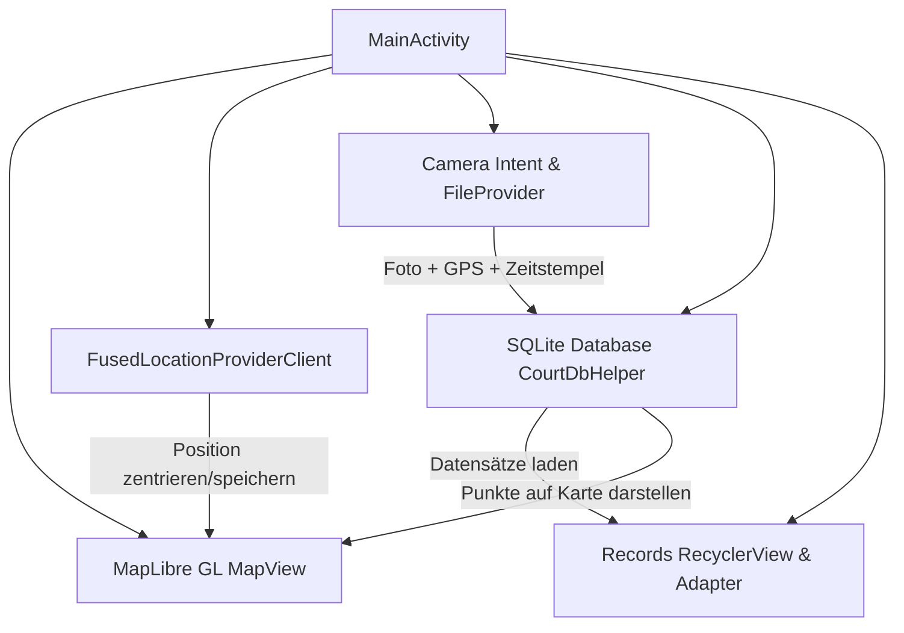

# Implementation Plan: CourtScout Android App (Java)

Erstellung einer vollständigen, lauffähigen Android-App "CourtScout" in Java (minSdk 26, targetSdk 34, kein Kotlin) für die Erfassung von Sportplätzen/Courts mit Georeferenzierung, MapLibre GL Vektorkarte, nativer Kamera-Integration, SQLite-Datenbank und RecyclerView-Übersicht.

## User Review Required

> [!IMPORTANT]
> - **Projektspeicherort**: Das Projekt wird unter `Projekt/CourtScout/` als vollständiges Gradle-Android-Projekt eingerichtet (kann direkt in Android Studio geöffnet werden).
> - **Karten-Style**: Es wird standardmäßig der freie MapLibre Demo-Vektorstyle (`https://demotiles.maplibre.org/style.json`) verwendet, mit einfacher Konfigurationsmöglichkeit für OpenStreetMap/Stadia/Raster-Tiles.
> - **UI-Struktur**: Die Hauptansicht ist die interaktive MapLibre-Karte mit Floating Action Buttons für Ortung und Foto-Aufnahme sowie einer ausziehbaren / umschaltbaren Bottom-Sheet / Listenansicht (RecyclerView) für alle aufgenommenen Fotos und Markierungen auf der Karte.

## Architektur & Komponenten

## Proposed Changes

### Projektstruktur (`Projekt/CourtScout/`)

#### Build & Konfiguration
- [NEW] `Projekt/CourtScout/build.gradle` (Root Gradle Script)
- [NEW] `Projekt/CourtScout/settings.gradle` (Settings Script)
- [NEW] `Projekt/CourtScout/gradle.properties`
- [NEW] `Projekt/CourtScout/gradle/wrapper/gradle-wrapper.properties`
- [NEW] `Projekt/CourtScout/gradlew` & `gradlew.bat` (Gradle Wrapper Scripts)
- [NEW] `Projekt/CourtScout/app/build.gradle` (App Dependencies: MapLibre Android SDK 11.5.1, Play Services Location, AndroidX AppCompat, Material Design, RecyclerView, ConstraintLayout)

#### Manifest & Ressourcen
- [NEW] `Projekt/CourtScout/app/src/main/AndroidManifest.xml` (Permissions: `ACCESS_FINE_LOCATION`, `ACCESS_COARSE_LOCATION`, `CAMERA`, FileProvider Setup)
- [NEW] `Projekt/CourtScout/app/src/main/res/xml/file_paths.xml` (FileProvider Pfade für Kamerabilder)
- [NEW] `Projekt/CourtScout/app/src/main/res/values/strings.xml`, `colors.xml`, `themes.xml` (Modernes Material 3 Theme)
- [NEW] `Projekt/CourtScout/app/src/main/res/drawable/` (Vektor-Icons für Ortung, Kamera, Liste, Marker)
- [NEW] `Projekt/CourtScout/app/src/main/res/layout/activity_main.xml` (MapView, FABs, Toolbar)
- [NEW] `Projekt/CourtScout/app/src/main/res/layout/bottom_sheet_records.xml` (RecyclerView für aufgenommene Fotos)
- [NEW] `Projekt/CourtScout/app/src/main/res/layout/item_record.xml` (Listenelement für ein Foto mit Thumbnail, Koordinaten, Zeitstempel)

#### Java Quellcode (`app/src/main/java/org/courtscout/`)
- [NEW] `model/CourtRecord.java`: Datenmodell (id, imagePath, latitude, longitude, timestamp)
- [NEW] `db/CourtDbHelper.java`: SQLiteOpenHelper Implementierung (Tabelle, Schema, CRUD-Methoden `insertRecord`, `getAllRecords`, `deleteRecord`)
- [NEW] `adapter/CourtRecordAdapter.java`: RecyclerView-Adapter mit ViewHolder, Klick-Listener (z. B. Zentrieren auf Karte, Vollbildanzeige)
- [NEW] `MainActivity.java`:
  - Initialisierung MapLibre GL mit Vector Tiles Style
  - Runtime Permissions Management (Location & Camera nach Android Best Practices)
  - Ortungsfunktion via `FusedLocationProviderClient` (Position ermitteln, Marker setzen, Kamerafahrt mit `CameraUpdateFactory`)
  - Kamera-Auslösung über `ActivityResultContracts.TakePicture()` und `FileProvider`
  - Verknüpfung von aktuellem GPS-Standort & Bilddatei & Abspeichern in SQLite
  - Synchronisierung mit RecyclerView und Markern auf der MapLibre-Karte
- [NEW] `doku.md` (Dokumentation aktualisieren mit Bauanleitung, Architektur und Verwendung)

## Verification Plan

### Manuelle & Code-Verifikation
- Syntaktische Prüfung aller Java-Dateien auf korrekte Imports, Android-API-Konformität und Null-Safety
- Validierung des Android-Manifests (Permissions, Provider-Authorities, Activity-Konfiguration)
- Validierung der XML-Layouts und Ressourcen (IDs, Material 3 Attribute, FileProvider-Pfade)
- Dokumentation zur Ausführung in Android Studio oder per `./gradlew assembleDebug`
