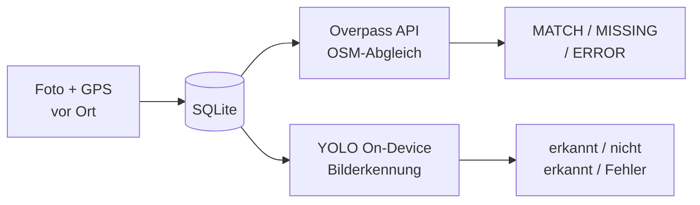

# Briefkasten Scout

Android-App zur automatisierten Erkennung fehlender Briefkästen (`amenity=post_box`) in OpenStreetMap: GPS-gestützter OSM-Abgleich (Overpass API) kombiniert mit On-Device-KI-Bilderkennung (selbst trainiertes YOLO-Modell, TensorFlow Lite).

**Modul:** Automatisierte Geodatenprozessierung · **Autor:** Ioannis Svolos · **Matrikelnummer:** 906758
**Ausführliche Kurzbeschreibung & Projektskizze:** [kurzbeschreibung.md](kurzbeschreibung.md) · **Volle technische Doku:** [doku.md](doku.md)

## Funktionsweise



Beide Prüfungen laufen unabhängig; **MISSING + visuell erkannt** = eine mit Foto belegte, echte Kartierungslücke.

## Demo-Video

<video src="https://github.com/Gianni-BIM/Briefk-sten_YOLO/releases/download/v1.0/BriefkastenScout-Demo.mp4" controls width="360"></video>


https://github.com/user-attachments/assets/0ddc83bf-0356-4cb1-aaa3-94103d4733f0


Falls das Video oben nicht abspielt: [Demo-Video direkt öffnen](https://github.com/Gianni-BIM/Briefk-sten_YOLO/releases/download/v1.0/BriefkastenScout-Demo.mp4) (nicht im Repo selbst gehostet, da > 50 MB).

## Screenshots

| | |
|---|---|
|  |  |
| OSM-Treffer & visuelle Erkennung stimmen überein (98,7 %) | MATCH (grün) vs. MISSING + nicht erkannt (rot) im Vergleich |
|  |  |
| Roboflow: Bounding-Box-Annotation der Trainingsfotos | Roboflow: automatischer Train/Valid/Test-Split |

Weitere Screenshots (Kartenansicht, Fehlerfall + Retry): Ordner [`screenshots/`](screenshots/).

## Ausführbare APK

Fertig kompilierte Debug-APK zum Installieren: [GitHub Release](https://github.com/Gianni-BIM/Briefk-sten_YOLO/releases) (nicht im Repo selbst, da > 50 MB).

## Bauen aus dem Quellcode

```bash
cd BriefkastenScout
./gradlew assembleDebug
```

Oder direkt in Android Studio: Ordner `BriefkastenScout/` öffnen.

## Projektstruktur

```
├── BriefkastenScout/     # Android-App (Java) inkl. trainiertem TFLite-Modell
├── M3_YOLO_Bootstrap/    # Trainingsdaten-Pipeline (OSM + Mapillary + Colab-Training)
├── Prompt 1–3/           # Spezifikationen je Ausbaustufe
├── screenshots/          # Alle App- und Trainings-Screenshots
├── doku.md               # Vollständige technische Dokumentation
└── kurzbeschreibung.md   # Kurzbeschreibung, Projektskizze, KI-Prozesskette
```

## KI-gestützte Prozesskette

App-Generierung aus Prompt-Spezifikationen via **Google Antigravity**, automatisierte Trainingsdaten-Erhebung über **OpenStreetMap** + **Mapillary**, Annotation via **Roboflow**, Training via **Google Colab** + **Ultralytics YOLOv8**, Export nach **TensorFlow Lite**. Details: [kurzbeschreibung.md](kurzbeschreibung.md).
