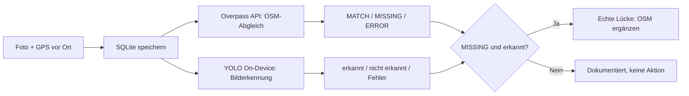

# Kurzbeschreibung Briefkasten Scout App

**Name:** Ioannis Svolos  
**Matrikelnummer:** 906758  
**Modul:** Automatisierte Geodatenprozessierung  

---

## Inhaltsverzeichnis
- [Projektidee](#projektidee)
- [Funktionsweise im Überblick](#funktionsweise-im-überblick)
- [Demo-Video](#demo-video)
- [Projektablauf in Bildern](#projektablauf-in-bildern)
- [Installation & Ausführung](#installation--ausführung)
- [Projektstruktur](#projektstruktur)
- [Die KI-gestützte automatisierte Prozesskette](#die-ki-gestützte-automatisierte-prozesskette)
- [Ergebnis & Grenzen](#ergebnis--grenzen)
---

## Projektidee

Die Briefkasten Scout App erfasst vor Ort fotografierte Briefkästen (OSM-Tag: `amenity=post_box`), vergleicht diese automatisch mit OpenStreetMap Daten via Overpass API und validiert das Foto zusätzlich mit einem lokal laufenden, selbst trainierten YOLO Modell zur Objekterkennung. Damit deckt die App den gesamten Workflow von der Vor-Ort Erfassung bis zur automatisierten OSM-Validierung ab.

Der Prozess von der Erfassung bis zur OSM Validierung läuft so ab:

1. **Erfassen:** Foto und präzise GPS Position werden vor Ort aufgenommen.
2. **OSM Abgleich:** Die Overpass API prüft im Hintergrund, ob an diesem Standort bereits ein Briefkasten in OSM existiert (MATCH / MISSING / ERROR).
3. **KI Check:** Ein selbst trainiertes YOLO Modell läuft direkt auf dem Gerät (via TensorFlow Lite) und prüft, ob auf dem Foto wirklich ein Briefkasten zu sehen ist.
4. **Ergebnis:** Die Kombination aus **MISSING (in OSM) + visuell bestätigt (durch KI)** deckt potenzielle Kartierungslücken, die durch ein Foto belegt sind.

---

## Funktionsweise im Überblick



---

## Demo-Video

https://github.com/user-attachments/assets/0ddc83bf-0356-4cb1-aaa3-94103d4733f0

---

## Projektablauf in Bildern

### 1. Datenaufbereitung & KI-Training (Roboflow & Colab)

**manuelle Bounding Box Annotation eines Briefkastens in Roboflow:**


**Übersicht des annotierten Datensatzes (114 von 821 Fotos mit Bounding Boxes):**


**automatischer Train/Valid/Test-Split (70/20/10) vor dem Export:**


**YOLOv8 Training in Google Colab & Export nach TFLite:**


### 2. App-Ergebnisse

| **Ausgangsmaterial: Echtes Foto eines Briefkastens (Datenbasis für Training & Test)** | **Erfolgreicher Testfall: OSM Treffer UND visuelle KI-Erkennung stimmen überein (98,7 % Konfidenz)** |
|---|---|
|  |  |

| **Ausgangsmaterial: Foto ohne Briefkasten (Negativtest)** | **Negativtest: OSM UND visuelle Erkennung stimmen korrekt überein (kein Briefkasten)** |
|---|---|
|  |  |

**Vergleich zweier Testfälle nebeneinander: MATCH (grün) vs. MISSING + nicht erkannt (rot), inkl. GPS-Steuerung im Emulator:**


---

## Installation & Ausführung

**Ausführbare APK:**  
Die fertig kompilierte Debug APK gibt es unter [GitHub Releases](https://github.com/Gianni-BIM/Briefk-sten_YOLO/releases) (nicht im Repo da > 50 MB).

**Bauen aus dem Quellcode:**
```bash
cd BriefkastenScout
./gradlew assembleDebug
```
*Alternativ:* Den Ordner `BriefkastenScout/` direkt in Android Studio öffnen.

---

## Projektstruktur

```text
├── BriefkastenScout/     # Android-App (Java) inkl. TFLite Modell
├── M3_YOLO_Bootstrap/    # Pipeline für Trainingsdaten (OSM + Mapillary + Colab)
├── Prompt 1–3/           # KI Prompts
├── screenshots/          # Alle Bilder für die Doku
```

---

## Die KI-gestützte automatisierte Prozesskette

App Generierung aus Prompt Spezifikationen via Google Antigravity, automatisierte Trainingsdaten Erhebung über OpenStreetMap + Mapillary, Annotation via Roboflow, Training via Google Colab + Ultralytics YOLOv8, Export nach TensorFlow Lite. Der Fokus dieses Experiments lag auf der vollständigen Automatisierung des Entwicklungs- und Datenprozesses durch KI:

- **App Entwicklung per KI (Google Antigravity):** Das Baugerüst der Android App entstand iterativ durch gezieltes Prompting (siehe [`Prompt 1/`](https://github.com/Gianni-BIM/Briefk-sten_YOLO/blob/main/Prompt%201/promt1.md), [`Prompt 2/`](https://github.com/Gianni-BIM/Briefk-sten_YOLO/blob/main/Prompt%202/promt2.md), [`Prompt 3/`](https://github.com/Gianni-BIM/Briefk-sten_YOLO/blob/main/Prompt%203/promt3.md)). Der Agent integrierte selbstständig MapLibre, GPS, Kamera, Overpass-API und das TensorFlow Lite Modell.
- **Trainingsdaten auf Knopfdruck:** Das Skript `M3_YOLO_Bootstrap/bootstrap.py` zieht bekannte Briefkästen aus OSM und verknüpft sie automatisch mit passenden **Mapillary-Streetview-Fotos**.
- **KI Modelltraining:** Nach der Annotation in **Roboflow** (114 Bilder, 70/20/10-Split) wurde ein **YOLOv8n**-Modell in **Google Colab** trainiert und als TensorFlow Lite Modell exportiert.
- **Automatisierter Stadt Scan:** `M3_YOLO_Bootstrap/city_scan.py` wendet das Modell flächendeckend auf Berliner Mapillary Fotos an und gleicht Treffer direkt mit OSM ab.

---

## Ergebnis & Grenzen

Die Pipeline funktioniert End-to-End: Briefkästen werden erkannt, mit OSM abgeglichen und visuell durch die KI bestätigt (bis zu 98,7 % Konfidenz beim echten Testfoto). 

Da das Modell mit nur 114 Bildern trainiert wurde, ist die Generalisierung auf neue, ungesehene Umgebungen naturgemäß noch begrenzt. Für dieses Proof of Concept ist es jedoch ein sehr erfolgreiches Ergebnis.
