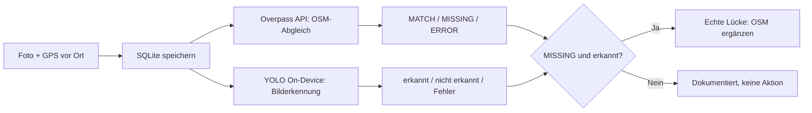

# Kurzbeschreibung – Briefkasten Scout App

**Name:** Ioannis Svolos
**Matrikelnummer:** 906758
**Modul:** Automatisierte Geodatenprozessierung

**Repository (Quellcode & ausführbarer Code):** https://github.com/Gianni-BIM/Briefk-sten_YOLO


# Projektidee

Android-App, die vor Ort fotografierte Briefkästen (`amenity=post_box`) automatisch gegen OpenStreetMap abgleicht (Overpass API) und zusätzlich per selbst trainiertem YOLO-Modell direkt auf dem Gerät erkennt, ob tatsächlich ein Briefkasten im Foto zu sehen ist.

**Briefkasten Scout** ist eine Android-App, die den kompletten Prozess von der Vor-Ort-Erfassung bis zur automatisierten Validierung gegen OpenStreetMap abbildet:

1. Foto + präzise GPS-Position werden vor Ort aufgenommen.
2. Eine automatisierte **Overpass-API-Abfrage** prüft im Hintergrund, ob an dieser Position bereits ein Briefkasten in OSM erfasst ist (MATCH / MISSING / ERROR).
3. Ein selbst trainiertes **YOLO-Modell** läuft direkt auf dem Gerät (TensorFlow Lite) und prüft unabhängig davon, ob auf dem Foto tatsächlich ein Briefkasten zu sehen ist.
4. Die aussagekräftigste Kombination – **MISSING + visuell bestätigt** – markiert eine mit Foto belegte, echte Kartierungslücke in OSM.


**Ausführliche Kurzbeschreibung & Projektskizze:** [kurzbeschreibung.md](kurzbeschreibung.md) · **Volle technische Doku:** [doku.md](doku.md)


## Funktionsweise



## Die KI-gestützte, automatisierte Prozesskette

Der Fokus dieses Experiments lag auf der **vollständigen Automatisierung des Entwicklungs- und Datenprozesses durch KI** anstelle von Handarbeit:

- **App-Entwicklung per KI (Google Antigravity):** Die Android-App entstand nicht durch manuelles Coden, sondern iterativ durch gezieltes Prompting (siehe `Prompt 1/`, `Prompt 2/`, `Prompt 3/` im Repository). Der KI-Agent integrierte selbstständig MapLibre, GPS, Kamera, Overpass-API und das TensorFlow-Lite-Modell.
- **Trainingsdaten auf Knopfdruck:** Das Skript `M3_YOLO_Bootstrap/bootstrap.py` zieht bekannte Briefkästen aus OSM und verknüpft sie automatisch mit passenden **Mapillary-Streetview-Fotos**. Manuelles Fotografieren vor Ort entfällt komplett.
- **KI-Modelltraining:** Nach der Annotation in **Roboflow** (114 von 821 Bildern markiert, 70/20/10-Split) wurde ein **YOLOv8n**-Modell in **Google Colab** trainiert und direkt für die App als TensorFlow Lite-Modell exportiert.
- **Automatisierter Stadt-Scan:** `M3_YOLO_Bootstrap/city_scan.py` wendet das Modell flächendeckend auf Berliner Mapillary-Fotos an und gleicht Treffer live mit OSM ab. Ein Proof-of-Concept, um Kartierungslücken im großen Stil direkt vom Schreibtisch aus zu finden.

Damit deckt das Projekt die gesamte geforderte Kette ab – von der per KI generierten GeoIT-App bis zur automatisierten Objekterkennung (On-Device).


## Ergebnis & Grenzen (siehe `doku.md`, Kapitel 8)

Die Pipeline funktioniert nachweislich End-to-End (siehe Screenshots unten): korrektes Erkennen bereits kartierter Briefkästen, korrektes Melden fehlender Briefkästen, und korrekte visuelle Bestätigung per selbst trainiertem Modell (98,7 % Konfidenz bei einem echten Testfoto). Bei nur 114 annotierten Trainingsbildern ist die Generalisierung des Modells auf beliebige Straßenfotos noch begrenzt (dokumentiert in `doku.md`) – ein realistisches, ehrlich reflektiertes Ergebnis für den Umfang dieses Experiments.


## Demo-Video

https://github.com/user-attachments/assets/0ddc83bf-0356-4cb1-aaa3-94103d4733f0


## Screenshots

| | |
|---|---|
|  |  |
| OSM-Treffer & visuelle Erkennung stimmen überein (98,7 %) | MATCH (grün) vs. MISSING + nicht erkannt (rot) im Vergleich |
|  |  |
| Roboflow: Bounding-Box-Annotation der Trainingsfotos | Roboflow: automatischer Train/Valid/Test-Split |

Weitere Screenshots (Kartenansicht, Fehlerfall + Retry): Ordner [`screenshots/`](screenshots/).

## Projektablauf mit Screenshots

**Roboflow: manuelle Bounding-Box-Annotation eines Briefkastens im Kandidaten-Foto:**


**Roboflow: Übersicht des annotierten Datensatzes (114 von 821 Fotos mit Bounding Boxes):**


**Roboflow: automatischer Train/Valid/Test-Split (70/20/10) vor dem Export:**


**Google Colab: YOLOv8-Training (Ultralytics) und Export nach TensorFlow Lite** (API-Key im Screenshot geschwärzt):


**Ausgangsmaterial – echtes Foto eines Briefkastens (Datenbasis für Training & Test):**


**Erfolgreicher Testfall – OSM-Treffer UND visuelle KI-Erkennung stimmen überein (98,7 % Konfidenz):**


**Vergleich zweier Testfälle nebeneinander – MATCH (grün) vs. MISSING + nicht erkannt (rot), inkl. GPS-Steuerung im Emulator:**


Alle weiteren Screenshots (inkl. Kartenansicht, Fehlerfall mit Retry-Funktion) liegen im Ordner [`screenshots/`](screenshots/).

## Ausführbare APK

Fertig kompilierte Debug-APK zum Installieren: [GitHub Release](https://github.com/Gianni-BIM/Briefk-sten_YOLO/releases) (nicht im Repo selbst, da > 50 MB).

## Bauen aus dem Quellcode

```bash
cd BriefkastenScout
./gradlew assembleDebug
```

Oder direkt in Android Studio: Ordner `BriefkastenScout/` öffnen.

## Projektstruktur

```
├── BriefkastenScout/     # Android-App (Java) inkl. trainiertem TFLite-Modell
├── M3_YOLO_Bootstrap/    # Trainingsdaten-Pipeline (OSM + Mapillary + Colab-Training)
├── Prompt 1–3/           # Spezifikationen je Ausbaustufe
├── screenshots/          # Alle App- und Trainings-Screenshots
├── doku.md               # Vollständige technische Dokumentation
└── kurzbeschreibung.md   # Kurzbeschreibung, Projektskizze, KI-Prozesskette
```

## KI-gestützte Prozesskette

App-Generierung aus Prompt-Spezifikationen via **Google Antigravity**, automatisierte Trainingsdaten-Erhebung über **OpenStreetMap** + **Mapillary**, Annotation via **Roboflow**, Training via **Google Colab** + **Ultralytics YOLOv8**, Export nach **TensorFlow Lite**. Details: [kurzbeschreibung.md](kurzbeschreibung.md).
