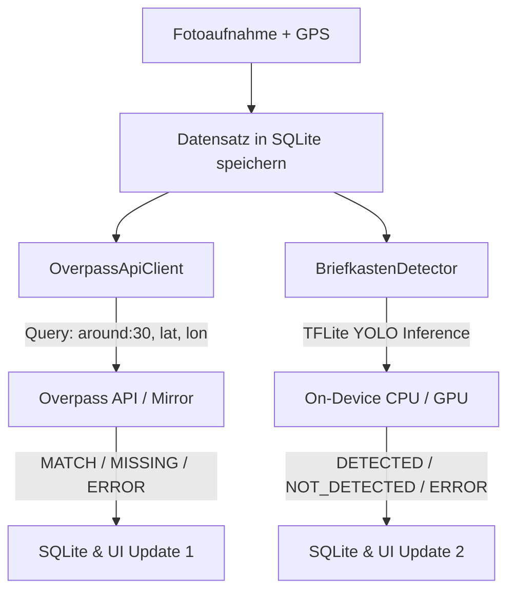

# Briefkasten Scout – Dokumentation

**Autor:** Ioannis Svolos · **Matrikelnummer:** 906758 · **Modul:** Automatisierte Geodatenprozessierung

## 1. Übersicht & Motivation
Im Rahmen des Moduls **Automatisierte Geodatenprozessierung** dient **Briefkasten Scout** als mobile Datenerfassungs-App für öffentliche Briefkästen (`amenity=post_box`).
In OpenStreetMap (OSM) existiert oft eine eklatante Lücke zwischen dem realen Bestand an Stadtmöblierung und den tatsächlich in OSM kartierten Objekten (vgl. die Kursfrage "Wie viele Sitzbänke gibt es in der OSM-Welt?" – geschätzt bis zu 1,5 Mrd., tatsächlich kartiert nur ca. 3,2 Mio.). Briefkasten Scout schließt diese Lücke am Beispiel von Briefkästen:
1. Der Nutzer nimmt vor Ort ein Foto auf.
2. Das Foto wird mit präzisen GPS-Koordinaten und Zeitstempel versehen.
3. **Automatische Overpass-API-Prüfung**: Im Hintergrund fragt die App die Overpass API ab, ob im Umkreis von 30 Metern bereits ein Briefkasten (`amenity=post_box`) existiert.
4. **Visuelle On-Device YOLO-Erkennung**: Parallel analysiert ein lokales TensorFlow-Lite-Modell (`briefkasten_detector.tflite`) das Foto, um festzustellen, ob darauf tatsächlich ein Briefkasten zu sehen ist.
5. **Farbliche Differenzierung**: Beide Prüfungen werden unabhängig voneinander visualisiert, haben aber unterschiedliche Bedeutung:
   - **OSM-Status** (Fotoliste & Kartenmarker, Grün/Rot/Grau): bezieht sich **nur auf die GPS-Position** – "gibt es hier laut OpenStreetMap-Datenbank schon einen Briefkasten?" Kommt aus der Overpass-API-Prüfung (Kapitel 4), unabhängig vom Bildinhalt.
   - **Visueller Status** (Detail-Dialog, ebenfalls Grün/Rot/Grau): bezieht sich **nur auf den Bildinhalt** – "ist auf *diesem konkreten Foto* tatsächlich ein Briefkasten zu erkennen?" Kommt aus der On-Device-Objekterkennung (YOLO, Kapitel 5), unabhängig von OSM.

   Beide Signale können unterschiedlich ausfallen (z. B. OSM kennt einen Briefkasten an dieser Stelle, aber im aktuellen Foto ist keiner zu sehen) – das ist kein Fehler, sondern zeigt, dass es sich um zwei unabhängige Prüfmechanismen handelt.

---

## 2. Technische Eckdaten
- **Programmiersprache:** Java (reine Java-Klassen, kein Kotlin)
- **UI-Framework:** Android XML-Layouts & Material Components 3
- **Min SDK:** 26 (Android 8.0 Oreo)
- **Target SDK:** 34 (Android 14)
- **Karten-Engine:** [MapLibre Native SDK for Android](https://github.com/maplibre/maplibre-native) (`org.maplibre.gl:android-sdk:11.5.1`) mit Vektortiles (OSM Demo Style)
- **Standortbestimmung:** Google Play Services Location (`FusedLocationProviderClient`, High Accuracy)
- **Kamera-Integration:** Nativer Android Kamera-Intent (`ActivityResultContracts.TakePicture`) mit sicherem `FileProvider`
- **Machine Learning (On-Device):** TensorFlow Lite (`org.tensorflow:tensorflow-lite:2.14.0`, `tensorflow-lite-support:0.4.4`, `tensorflow-lite-gpu:2.14.0`) mit Ultralytics YOLOv8/v9/v11 Modell
- **Lokale Persistenz:** SQLite (`SQLiteOpenHelper`, Schema-Version 3 mit Migration)
- **Hintergrundabfragen:** `ExecutorService` mit `HttpURLConnection`, automatischer Fallback-Mirror-Logik und `org.json`
- **Listenübersicht:** `RecyclerView` mit `BriefkastenRecordAdapter`, zweistufigen Status-Badges und Glide

---

## 3. Architektur & Komponenten

```
Projekt/BriefkastenScout/
├── app/
│   ├── build.gradle                          # Dependencies: MapLibre, Play Services, TFLite, Glide, AndroidX
│   └── src/
│       └── main/
│           ├── assets/
│           │   └── briefkasten_detector.tflite   # Ultralytics YOLOv8/v9/v11 TFLite-Modell (On-Device)
│           ├── AndroidManifest.xml           # Permissions (GPS, Kamera, Internet), FileProvider
│           ├── java/org/briefkastenfinder/
│           │   ├── MainActivity.java         # Hauptaktivität: MapLibre, FABs, parallele Prüfungen (OSM + YOLO)
│           │   ├── model/
│           │   │   └── BriefkastenRecord.java      # POJO mit OSM- & Visual-Feldern (Status, Konfidenz, Fehler)
│           │   ├── db/
│           │   │   └── BriefkastenDbHelper.java    # SQLiteOpenHelper mit Version 3 Upgrade & Migration
│           │   ├── ml/
│           │   │   └── BriefkastenDetector.java  # TFLite Interpreter, GPU/CPU Delegate, Vor-/Nachverarbeitung & NMS
│           │   ├── net/
│           │   │   └── OverpassApiClient.java # Overpass QL Query, Fallback-Mirror, Timeouts & Parser
│           │   └── adapter/
│           │       └── BriefkastenRecordAdapter.java # RecyclerView Adapter mit doppelten Status-Badges (OSM & Visuell)
│           └── res/
│               ├── layout/
│               │   ├── activity_main.xml     # MapView + FABs + BottomSheet
│               │   ├── item_record.xml       # Listenelement mit Thumbnail, Lat/Lng, OSM- & Visual-Badges
│               │   └── dialog_record_detail.xml # Modal für Großansicht, Exif, OSM- & YOLO-Ergebnisse
│               ├── drawable/                 # Vektor-Icons (Marker Grün, Rot, Grau; Retry; Kamera; GPS)
│               ├── values/                   # Strings, Colors, Themes (Material 3)
│               └── xml/
│                   └── file_paths.xml        # FileProvider-Konfiguration
├── build.gradle                              # Root Gradle Build Script
├── settings.gradle                           # Projekt-Settings
├── gradle.properties                         # JVM & AndroidX Settings
└── gradlew                                   # Gradle Wrapper Shell Script
```

---

## 4. Funktionsweise der Overpass-API-Prüfung

### 4.1 Overpass-QL-Query
Sobald ein Foto mit GPS-Koordinaten aufgenommen und gespeichert wird, sendet `OverpassApiClient` folgende Abfrage:

```overpass
[out:json][timeout:25];
(
  nwr["amenity"="post_box"](around:30,{lat},{lon});
);
out center;
```

### 4.2 Auswertung & strikte Status-Trennung
- **`MATCH` (Grün):** Overpass antwortet mit HTTP 200 und mindestens 1 Element im 30m-Radius. Die OSM-ID (`node/...`, `way/...` oder `relation/...`) sowie die mit `Location.distanceBetween` berechnete Distanz werden in der Datenbank gespeichert (für spätere Auswertung/Export), in der UI aber bewusst nicht mehr angezeigt, um die Anzeige einfach und lesbar zu halten (nur "Bereits in OSM erfasst").
- **`MISSING` (Rot):** Overpass antwortet mit HTTP 200 und `elements.length == 0`. Der Briefkasten fehlt in OSM und wurde erfolgreich als fehlend identifiziert.
- **`ERROR` (Grau):** Timeout, Verbindungsfehler, HTTP-Status != 200, ungültiges/leeres JSON oder keine Netzwerkverbindung. Schlägt eine Anfrage fehl, wird der Datensatz **niemals** als `MISSING` markiert.
- **`PENDING` (Orange):** Die Prüfung läuft aktuell im Hintergrund.

### 4.3 Fallback-Mirror & Timeouts
- **Timeouts:** Connect-Timeout: 10 Sekunden, Read-Timeout: 15 Sekunden.
- **Automatischer Fallback-Mirror:** 
  1. Primärer Server: `https://overpass-api.de/api/interpreter`
  2. Schlägt der primäre Server fehl, wird **automatisch** ein zweiter Versuch gegen `https://overpass.kumi.systems/api/interpreter` unternommen, bevor endgültig auf `ERROR` geschaltet wird.

---

## 5. Visuelle On-Device-Erkennung (YOLO/TFLite)

### 5.1 Architektur & Modell-Integration
Die visuelle Erkennung ist in der Klasse `BriefkastenDetector` (`org.briefkastenfinder.ml`) gekapselt.
- **Modell-Ablage:** `app/src/main/assets/briefkasten_detector.tflite` (in `app/build.gradle` via `aaptOptions { noCompress "tflite" }` unkomprimiert abgelegt).
- **Hardware-Beschleunigung:** Beim Start prüft `BriefkastenDetector` mittels `CompatibilityList`, ob das Gerät für GPU-Beschleunigung geeignet ist, und bindet `GpuDelegate` ein. Andernfalls erfolgt ein stabiler Fallback auf 4 CPU-Threads.
- **Thread-Sicherheit:** Die Inferenz wird auf einem dedizierten `ExecutorService` ausgeführt und blockiert den UI-Thread zu keinem Zeitpunkt.

### 5.2 Modell-Input & Vorverarbeitung
- **Input-Format:** Tensor Shape `[1, 3, 640, 640]` (NCHW/Channels-First -- der neuere LiteRT-Torch-Exportpfad behält PyTorchs Layout bei, statt auf klassisches TFLite-NHWC zu transponieren), Datentyp `FLOAT32`. Layout wird zur Laufzeit über `interpreter.getInputTensor(0).shape()` erkannt, um dieses Detail robust gegenüber künftigen Modell-Exporten zu behandeln.
- **Vorverarbeitung:** Das aufgenommene Foto wird auf 640x640 Pixel skaliert und die RGB-Farbwerte werden auf den Wertebereich `[0.0, 1.0]` normalisiert (`pixel / 255.0f`).

### 5.3 Modell-Output & Nachverarbeitung (NMS)
- **Output-Format:** Ultralytics YOLOv8/v9/v11 exportiert die Vorhersagen typischerweise als Shape `[1, 4 + classes, 8400]` (wobei die ersten 4 Kanäle für `cx, cy, w, h` stehen und die folgenden Kanäle die Klassen-Scores darstellen) oder `[1, 8400, 4 + classes]`.
- **Confidence Filtering:** Nur Vorhersagen mit einer Klassen-Konfidenz $\ge 0.25$ werden als Kandidaten-Bounding-Boxen akzeptiert.
- **Non-Maximum Suppression (NMS):** Mittels Intersection-over-Union (IoU $\ge 0.45$) werden überlappende Boxen gefiltert, um Doppelerkennungen zu vermeiden.
- **Ergebnis-Klassifizierung:**
  - `VISUAL_DETECTED` (Grün): Mindestens ein Briefkasten erkannt; die maximale Konfidenz (z. B. `94.2%`) wird im Datensatz gespeichert.
  - `VISUAL_NOT_DETECTED` (Rot): Inferenz erfolgreich durchgelaufen, aber kein Briefkasten im Foto erkannt.
  - `VISUAL_ERROR` (Grau): Datei fehlt, Korruption, Inferenzfehler oder unzureichender Arbeitsspeicher. Schlägt die Bildanalyse fehl, wird der Datensatz **niemals** fälschlich als "nicht erkannt" eingestuft.

### 5.4 Zusammenspiel mit der Overpass-API-Prüfung
Die beiden Prüfungen laufen vollkommen **parallel und unabhängig voneinander**:

Dadurch entsteht eine zweistufige Validierung:
1. **Existiert der Briefkasten in OSM?** (Geodaten-Abgleich)
2. **Ist auf dem Foto tatsächlich ein Briefkasten zu sehen?** (Computer Vision On-Device)

### 5.5 Bild-Import aus der Galerie (Alternative zur Live-Kamera)
Langes Drücken auf den Kamera-Button öffnet statt der Live-Kamera den System-
Bildauswähler (`ActivityResultContracts.GetContent`). Das gewählte Bild wird
in den App-eigenen Bilderordner kopiert und durchläuft danach exakt denselben
GPS-/Speicher-/Prüfablauf wie ein live aufgenommenes Foto. Nützlich, um die
visuelle Erkennung mit einem bereits vorhandenen echten Foto zu testen (z. B.
wenn keine Live-Aufnahme vor Ort möglich ist).

**Wichtiger Hinweis zur GPS-Quelle:** Die App liest keine GPS-Metadaten aus
der importierten Bilddatei selbst, sondern nutzt in beiden Fällen (Kamera
und Galerie-Import) die **aktuelle Live-Position des Geräts** im Moment der
Aufnahme/Auswahl. Bei einem echten Foto aus der Galerie, das an einem anderen
Ort/zu einem anderen Zeitpunkt aufgenommen wurde, würde die App es fälschlich
mit dem *aktuellen* Standort taggen. Für den produktiven Feldeinsatz ist daher
die Live-Kamera (Foto und GPS entstehen im selben Moment) der vorgesehene Weg;
der Galerie-Import dient primär Test-/Entwicklungszwecken.

**Validierung (Positivtest):** Mit einem echten Mapillary-Foto eines
bekannten Briefkastens (GPS exakt auf `node/3081682941` gesetzt) lieferte die
App im Emulator: `OSM: Bereits erfasst (node/3081682941, 0.2 m)` UND
`Visuell: Briefkasten erkannt (Konfidenz: 98.7 %)` – beide Prüfungen
bestätigen unabhängig voneinander denselben realen Briefkasten.

**Validierung (Negativtest):** Mit einem echten Straßenfoto ohne Briefkasten
(GPS auf das Tempelhofer Feld gesetzt, wo kein Briefkasten in der Nähe
kartiert ist) lieferte die App: `OSM: Nicht erfasst (Fehlt in OSM)` UND
`Visuell: Kein Briefkasten erkannt` – auch hier stimmen beide unabhängigen
Prüfungen korrekt überein.

Diese beiden Gegentests bestätigen, dass das Modell bei sauberen,
nicht-sphärischen Fotos zuverlässig zwischen "Briefkasten vorhanden" und
"kein Briefkasten vorhanden" unterscheidet (siehe Kapitel 8 für die
Einschränkung bei 360°-Panoramen und fremden Objekten).

---

## 6. Typischer Workflow (Feldeinsatz)

So ist die App für den produktiven Einsatz gedacht:

1. Nutzer:in geht durch ein Viertel (z. B. als ehrenamtliche:r OSM-Mapper:in)
   und entdeckt einen Briefkasten am Straßenrand.
2. App öffnen, Kamera-Button antippen, Briefkasten direkt vor Ort fotografieren.
3. Foto und aktuelle GPS-Position werden gemeinsam gespeichert.
4. Im Hintergrund laufen automatisch und parallel zwei Prüfungen:
   - Overpass-Check: Existiert hier schon ein Briefkasten in OSM (30 m-Radius)?
   - YOLO-Check: Ist auf dem Foto tatsächlich ein Briefkasten zu sehen?
5. Innerhalb weniger Sekunden erscheint das Ergebnis:
   - In der Liste/Kartenmarker (OSM-Status, aus der Overpass-Prüfung):
     🟢 **MATCH** (schon in OSM erfasst) oder 🔴 **MISSING** (fehlt in OSM).
   - Im Detail-Dialog zusätzlich der visuelle Status (aus der Objekterkennung):
     🟢 **Briefkasten erkannt** oder 🔴 **Kein Briefkasten erkannt** – unabhängig
     vom OSM-Status.
   - Am aussagekräftigsten ist die Kombination: MISSING **und** visuell
     erkannt = eine mit Foto belegte, echte Kartierungslücke.
6. Bei einer solchen Lücke: Foto + GPS-Koordinaten aus der App entnehmen und den
   Briefkasten manuell in OpenStreetMap eintragen (z. B. über den iD-Editor
   auf openstreetmap.org, Tag `amenity=post_box`).
7. Nach einem Rundgang durch mehrere Straßen liegt eine vollständige,
   fotobelegte Liste aller geprüften Standorte vor – wie ein
   Mapping-Einsatzprotokoll für ein Viertel.
8. Die roten Einträge bilden die konkrete To-Do-Liste für OSM-Ergänzungen.

---

## 7. Bauen & Ausführen

### In Android Studio
1. Android Studio öffnen -> **Open...** -> Ordner `Projekt/BriefkastenScout` auswählen.
2. Gradle-Sync abwarten.
3. App auf Gerät oder Emulator starten.

### Per Terminal
```bash
cd "/Users/ioannissvolos/Desktop/Master/Automatisierte Geodatenprozessierung/Projekt/BriefkastenScout"
./gradlew assembleDebug
```
APK-Pfad: `app/build/outputs/apk/debug/app-debug.apk`

---

## 8. Grenzen & Ausblick der visuellen Erkennung

Die Overpass-API-Prüfung (Kapitel 4) ist deterministisch und wurde ausführlich
mit realen GPS-Koordinaten validiert. Für die YOLO-Bilderkennung (Kapitel 5)
gilt das nur eingeschränkt, was hier bewusst offen dokumentiert wird:

- **Trainingsdatengröße:** Das Modell wurde auf ca. 130 manuell in Roboflow
  annotierten Briefkasten-Fotos trainiert (`mAP50 ≈ 0.73` auf einem sehr
  kleinen Validierungsset von 23 Bildern). Ein direkter Feldtest in der App
  (Kapitel 5.5, echtes Foto + reale GPS-Koordinaten) bestätigte, dass das
  Modell bei einem sauberen, nicht-sphärischen Foto mit 98,7 % Konfidenz
  korrekt erkennt – die Pipeline liefert also trotz der kleinen Datenmenge
  bereits brauchbare Ergebnisse auf realen Fotos, ist aber (siehe unten) noch
  nicht robust gegenüber allen Bildarten.
- **Validierter Bug-Fix:** Der ursprüngliche Modell-Export (`litert_torch`)
  erwartet Channels-First-Input (`[1,3,640,640]`) statt des klassischen
  TFLite-Layouts (`[1,640,640,3]`). `BriefkastenDetector` erkennt das Layout jetzt
  zur Laufzeit korrekt (siehe 5.2).
- **Generalisierungs-Test:** Eine stichprobenartige Anwendung des Modells auf
  breit über Berlin verteilte, dem Modell unbekannte Mapillary-Fotos (Skript
  `Projekt/M3_YOLO_Bootstrap/city_scan.py`) zeigte, dass das Modell
  kastenförmige Objekte auf Pfosten (z. B. Mülleimer) mit Briefkästen
  verwechseln kann. Die dabei erzeugte Kandidatenliste ist daher **nicht**
  als verifizierter Nachweis neuer OSM-Lücken zu verstehen, sondern als
  Beleg dafür, dass die Pipeline technisch funktioniert und wo ihre aktuellen
  Grenzen liegen.
- **Ausblick:** Mit mehr Trainingsdaten (mehrere hundert bis tausend
  annotierte Bilder je Objektklasse, idealerweise inkl. Negativbeispielen wie
  Mülleimern/Verteilerkästen) und echten Feldtests mit einer physischen
  Kamera ließe sich die Erkennungsgenauigkeit deutlich verbessern.
